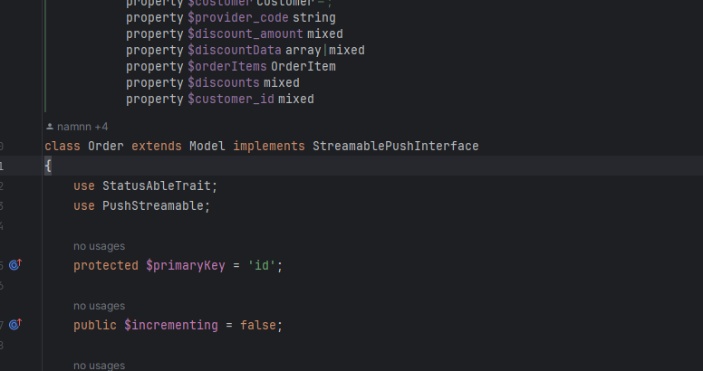
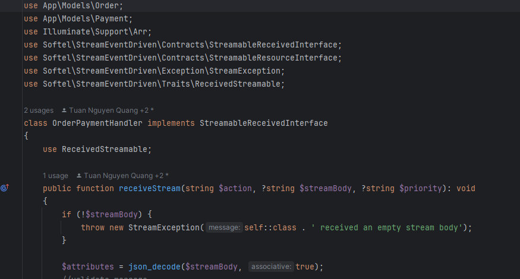
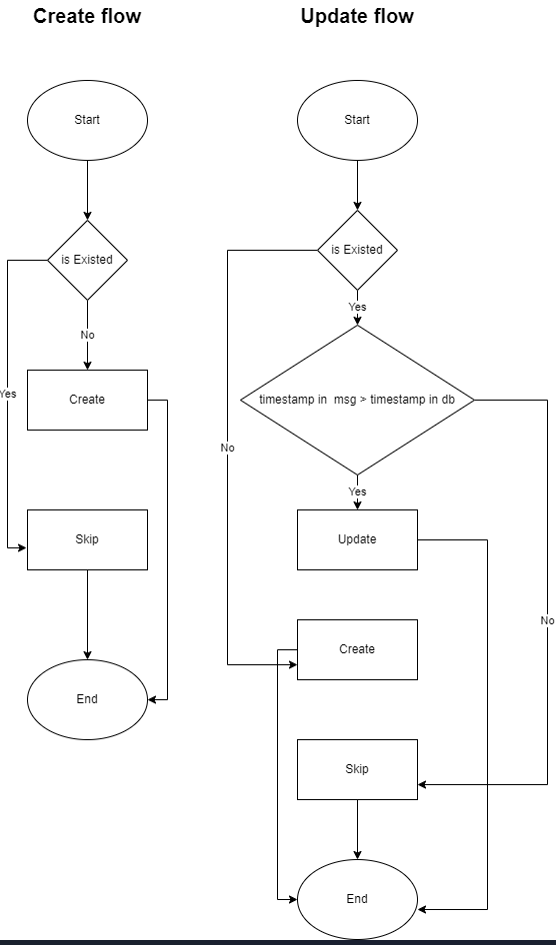

# Requirements
- PHP ^8.1
# To install this package in your project
1. Copy this and paste to repository array in composer.json
    ```sh
    "repositories": [
      {
        "type": "vcs",
        "url": "https://github.com/hoangnm97/stream-event"
      },
   ...
    
   ]
   ```
2. Import this provider to config/app.php 
    ```sh
   'providers' => ServiceProvider::defaultProviders()->merge([
      \Hoangdev\StreamEventDriven\Providers\EventDrivenProvider::class
      ...
   ])->toArray(),
   ```
3. run command
    ```sh
    composer require hoangdev/stream-event-driven:dev-main
   ```
   To the package (note: remember to push newest package)
4. Run
   ```sh
   php artisan vendor:publish --provider="Hoangdev\StreamEventDriven\Providers\EventDrivenProvider"
   ```
5. Add this env variable: example:
   ```sh
    STREAM_PLATFORM=kafka
    KAFKA_GROUP_ID=orders
    KAFKA_SYNC_TOPIC=orders
    KAFKA_SYNC_USERNAME=
    KAFKA_SYNC_PASSWORD=
    KAFKA_BROKERS=kafka:9092
   ```
   to publish migration and resource
- Execute to kafka container and run the commands below:
    + To create new topic:<br />
      <code>kafka-topics.sh --bootstrap-server localhost:9092 --topic test --create --partitions 3 --replication-factor 1</code>
    + To send a message to topic:<br />
      <code>kafka-console-producer.sh --bootstrap-server localhost:9092 --topic test</code>
    + To get message from topic:<br />
      <code>kafka-console-consumer.sh --bootstrap-server localhost:9092 --topic test</code>
# Usage
- Implement ``Hoangdev\StreamEventDriven\Contracts\StreamableReceivedInterface`` into the class you need to handle received with kafka and use ``Hoangdev\StreamEventDriven\Traits\ReceivedStreamable`` as a trait.
- Then you can use/overwrite the needed method in you class. After all, you can call method ``receiveStream()`` to handle your messages
- You need to have a column with value is timestamp in database in the updated/create object for the compare like the flow below
- Implement ``Hoangdev\StreamEventDriven\Contracts\StreamablePushInterface`` into the class you need to handle received with kafka and use ``Hoangdev\StreamEventDriven\Traits\PushStreamable`` as a trait.
- Then you can use/overwrite the needed method in you class. After all, you can call method ``pushStream()`` to handle your messages
- Example:


Need to follow this flow to make sure that you are going the right way:


- Custom object + action:
  - For add custom action, need to over-write trait and add suitable boot and over-write followed interface if needed